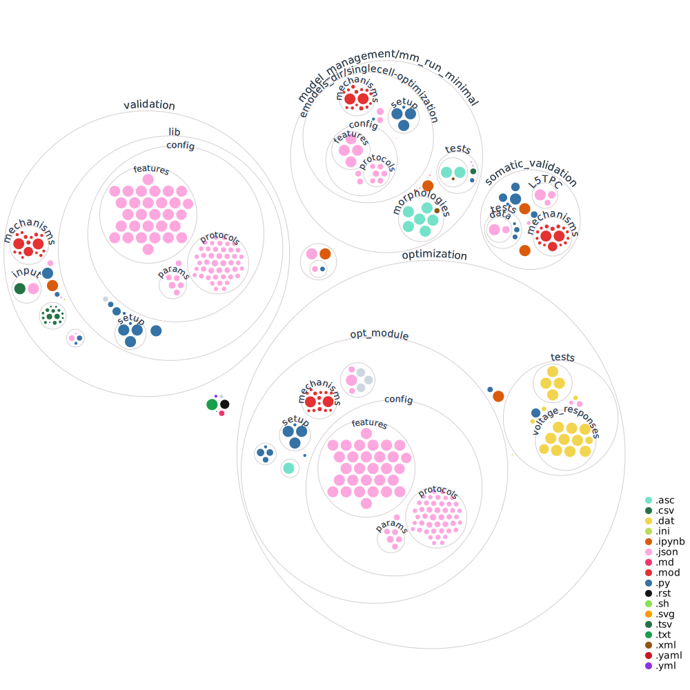

A universal workflow for creation, validation, and generalization of detailed neuronal models: demo
===================================================================================================

+----------------+------------+
| License        | |license|  |
+----------------+------------+
| Build Status 	 | |build|    |
+----------------+------------+
| Publication    | |doi|      |
+----------------+------------+

Introduction
---------

The biophysically detailed electrical neuron model (e-model) is one of the central tools in neuroscience. Here we present a demo of the single neuron e-model creation, validation, and generalization described in `A universal workflow for creation, validation, and generalization of detailed neuronal models (Reva, Rossert et al) <https://doi.org/10.1016/j.patter.2023.100855>`_. 

This demo is built on the example of L5PC of the SSCx in juvenile rat. 

Structure of the codebase
~~~~~~~~~~~~~~~~~~~~~~~~~

The figure offers a visual representation of the codebase, showcasing its structure. Orange circles indicate the reproducible interactive Python notebooks (ipynb files), while blue circles represent the Python modules (py files). Pink circles correspond to the json files, which contain parameters for all cell types in the SSCx.

Although the demonstration primarily focuses on the L5PC example, we still provide the `configuration for all other cell types <https://github.com/BlueBrain/SSCxEModelExamples/tree/main/optimization/opt_module/config>`_, `morphologies  <https://github.com/BlueBrain/SSCxEModelExamples/tree/main/validation/input/morphologies>`_ and the `mechanisms <https://github.com/BlueBrain/SSCxEModelExamples/tree/main/optimization/opt_module/mechanisms>`_ as resources for the community.

Citation
--------
When you using methods or code from this repository for your research, we ask you to cite the following publication:

A universal workflow for creation, validation, and generalization of detailed neuronal models" (Reva, Rossert et al).

.. code-block:: 

    @ARTICLE{Reva2022.12.13.520234,
	author = {Reva, Maria and R{\"o}ssert, Christian and Arnaudon, Alexis and Damart, Tanguy and Mandge, Darshan and Tuncel, An{\i}l and Ramaswamy, Srikanth and Markram, Henry and Van Geit, Werner},
	title = {A universal workflow for creation, validation and generalization of detailed neuronal models},
	elocation-id = {2022.12.13.520234},
	year = {2022},
	doi = {10.1101/2022.12.13.520234},
	publisher = {Cold Spring Harbor Laboratory},
	abstract = {Detailed single neuron modeling is widely used to study neuronal functions. While cellular and functional diversity across the mammalian cortex is vast, most of the available computational tools are dedicated to the reproduction of a small set of specific features characteristic of a single neuron. Here, we present a generalized automated workflow for the creation of robust electrical models and illustrate its performance by building cell models for the rat somatosensory cortex (SSCx). Each model is based on a 3D morphological reconstruction and a set of ionic mechanisms specific to the cell type. We use an evolutionary algorithm to optimize passive and active ionic parameters to match the electrophysiological features extracted from whole-cell patch-clamp recordings. To shed light on which parameters are constrained by experimental data and which could be degenerate, we perform a parameter sensitivity analysis. We also validate the optimized models against additional experimental stimuli and assess their generalizability on a population of morphologies with the same morphological type. With this workflow, we generate SSCx neuronal models producing the variability of neuronal responses. Due to its versatility, our workflow can be used to build robust biophysical models of any neuronal type.Competing Interest StatementThe authors have declared no competing interest.},
	URL = {https://www.biorxiv.org/content/early/2022/12/13/2022.12.13.520234},
	eprint = {https://www.biorxiv.org/content/early/2022/12/13/2022.12.13.520234.full.pdf},
	journal = {bioRxiv}
	}

Pipeline
---------

Figure illustrating all steps of the pipeline in detail. The pipeline consists of four steps: (1) feature extraction, (2) optimization, (3) validation, and (4) generalization.

1. E-feature extraction
~~~~~~~~~~~~~~~~~~~~~~~

The `feature_extraction <https://github.com/BlueBrain/SSCxEModelExamples/tree/main/feature_extraction>`_ folder contains data and code that show how to the electrical features (e-features) are extracted from the voltage traces.

E-features are extracted for six L5PCs, their traces are located in the `feature_extraction/input-traces <https://github.com/BlueBrain/SSCxEModelExamples/tree/main/feature_extraction/input-traces>`_ folder.

The `requirements.txt <https://github.com/BlueBrain/SSCxEModelExamples/blob/main/requirements.txt>`_ at the main directory needs to be installed to run the `feature-extraction.ipynb <https://github.com/BlueBrain/SSCxEModelExamples/blob/main/feature_extraction/feature-extraction.ipynb>`_::

    pip install -r requirements.txt

2. Optimization
~~~~~~~~~~~~~~~

The `optimization <https://github.com/BlueBrain/SSCxEModelExamples/tree/main/optimization>`_ folder contains tools and codes necessary to run and display the result of the canonical e-model optimization.

Install the `requirements.txt <https://github.com/BlueBrain/SSCxEModelExamples/blob/main/requirements.txt>`_ at the main directory and run `Minimal_cADpyr_L5TPC_Optimization.ipynb <https://github.com/BlueBrain/SSCxEModelExamples/blob/main/optimization/Minimal_cADpyr_L5TPC_Optimization.ipynb>`_ to visualize the results of the optimization.

Prior to launching the notebook, one needs to compile e-model' mechanisms by running::

    sh compile_mechanisms.sh

The `optimization/opt_module <https://github.com/BlueBrain/SSCxEModelExamples/tree/main/optimization/opt_module>`_ folder contains tools and data necessary for the optimization such as morphology, mechanisms, checkpoints, and config files.

3. Validation
~~~~~~~~~~~~~
Two types of validation were performed for the optimized L5PC e-model.

The visualization of the bAP/EPSP validations can be found in `validation.ipynb <https://github.com/BlueBrain/SSCxEModelExamples/blob/main/validation/validation.ipynb>`_ notebook.

The morphologies for these validations are located in the `input/morphologies <https://github.com/BlueBrain/SSCxEModelExamples/tree/main/validation/input/morphologies>`_ folder.

To run bAP/EPSP validations use:: 

  python main.py att_conf.json

The `requirements.txt <https://github.com/BlueBrain/SSCxEModelExamples/blob/main/requirements.txt>`_ at the main directory needs to be installed and the mechanisms need to be compiled with::

  nrnivmodl mechanisms

Somatic validations are located in the `somatic_validation <https://github.com/BlueBrain/SSCxEModelExamples/tree/main/somatic_validation>`_ folder.

Note that this is the only step that does not use the ``requirements.txt`` in the main directory.

`somatic-val-requirements.txt <https://github.com/BlueBrain/SSCxEModelExamples/blob/main/somatic_validation/somatic-val-requirements.txt>`_ needs to be installed and the mechanisms need to be compiled with the following command before running the notebooks:: 

  nrnivmodl mechanisms 
  
First, e-features for the validations have to be extracted from the chosen patch clamp protocol. To extract e-features use `feature-extraction.ipynb <https://github.com/BlueBrain/SSCxEModelExamples/blob/main/somatic_validation/feature-extraction.ipynb>`_, the results of this extraction can be found in the `somatic_validation/L5TPC <https://github.com/BlueBrain/SSCxEModelExamples/tree/main/somatic_validation/L5TPC>`_ folder. To run and visualize results of the somatic validation run `somatic-validation.ipynb <https://github.com/BlueBrain/SSCxEModelExamples/blob/main/somatic_validation/somatic-validation.ipynb>`_.

4. Generalization
~~~~~~~~~~~~~~~~~

Once again the `requirements.txt <https://github.com/BlueBrain/SSCxEModelExamples/blob/main/requirements.txt>`_ at the main directory needs to be installed.

The generalization of the canonical L5PC e-model to a number of morphologies is done with `BluePyMM <https://github.com/BlueBrain/BluePyMM>`_.

To run a generalization use the `model-management.ipynb <https://github.com/BlueBrain/SSCxEModelExamples/blob/main/model_management/mm_run_minimal/model-management.ipynb>`_ notebook in `/model_management/mm_run_minimal <https://github.com/BlueBrain/SSCxEModelExamples/tree/main/model_management/mm_run_minimal>`_ directory.

The morphologies used in the step can be found in the `/model_management/mm_run_minimal/morphologies/ <https://github.com/BlueBrain/SSCxEModelExamples/tree/main/model_management/mm_run_minimal/morphologies>`_ folder.

Testing
-------

Each step is of the pipeline contains tests.
Before running the notebooks, we recommend running the tests to make sure you will get the expected results.

To run the tests, simply execute the following command::

	make tests

Compiling all mechanisms
------------------------

Instead of manually compiling the mechanisms for each step of the pipeline, the following command can be used for compiling all mechanisms before running the notebooks::

	make compile-all-mechanisms

Requirements
------------

The `requirements.txt <https://github.com/BlueBrain/SSCxEModelExamples/blob/main/requirements.txt>`_ at the main directory should be used for all steps except for the somatic validations.
Install `somatic-val-requirements.txt <https://github.com/BlueBrain/SSCxEModelExamples/blob/main/somatic_validation/somatic-val-requirements.txt>`_ before running the somatic validation notebooks or tests.

Funding
-------
This project/research was supported by funding to the Blue Brain Project, a research center of the École polytechnique fédérale de Lausanne (EPFL), from the Swiss government’s ETH Board of the Swiss Federal Institutes of Technology.

License
-------

This work is licensed under `Creative Commons (CC BY) 4.0 <https://creativecommons.org/licenses/by/4.0/>`_ 

For MOD files for which the original source is available on ModelDB, any specific licenses on mentioned on ModelDB, or the generic License of ModelDB apply.

.. |build| image:: https://github.com/BlueBrain/SSCxEModelExamples/actions/workflows/python-app.yml/badge.svg
                :target: https://github.com/BlueBrain/SSCxEModelExamples/actions/workflows/python-app.yml
                :alt: Build Status

.. |license| image:: https://img.shields.io/badge/License-CC_BY_4.0-lightgrey.svg
	:target: https://github.com/BlueBrain/SSCxEModelExamples/blob/main/LICENSE.txt
	:alt: license

.. |doi| image:: https://img.shields.io/badge/DOI-10.1016/j.patter.2023.100855-blue
                :target: https://doi.org/10.1016/j.patter.2023.100855
